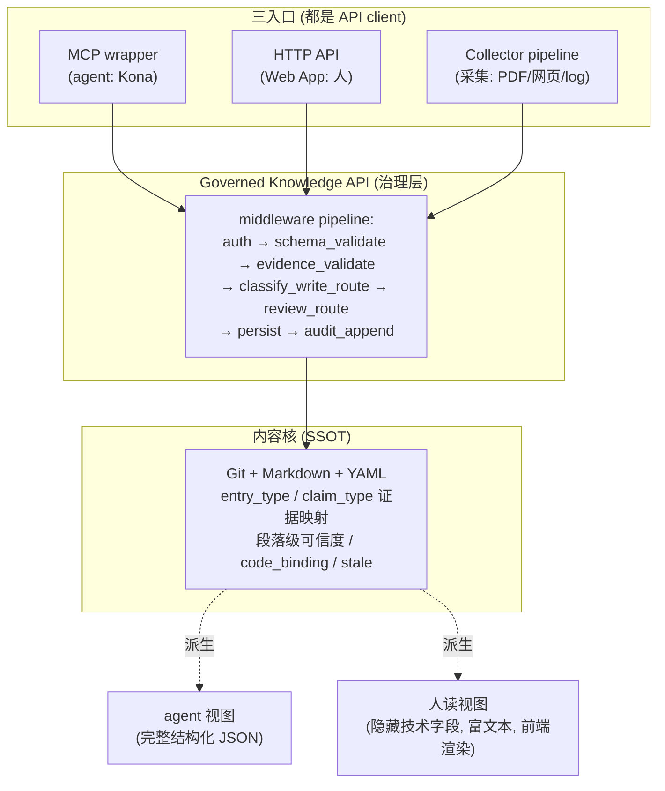
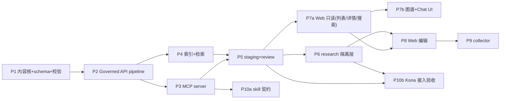

# 统一知识库（Unified Knowledge Base）设计文档

> **本文档定位**：合并 LLM Wiki v10（团队人读知识库）与 排查知识库 KB v5（agent 消费知识库）为一个统一知识库的高层设计。**替代并归档** `troubleshooting_kb_hld_v5.md` 和 LLM Wiki v10 `design_hld_FROZEN.md` 两份文档，以本文档为唯一基线。
>
> **本文档遵循团队《AI 设计文档生成规范》**（R1–R14 + 0-9 章固定结构 + 强制 Phase DAG 章）。
>
> **评审历程**：KB 线经 Kona 三轮 + 三方两轮冻结为 v5；合并线经三方三轮 + Kona 两轮收敛；本文档定稿后经三方交付前 review（v1.0→v1.1）。
>
> **v1.1 变更**：开发语言定 Python / Phase DAG 修 3 处依赖 bug / 补 §4.4 类型定义 / ID SQLite 发号 / collector 闭环 / 口径统一 / OPEN 整理。
> **v1.2 变更（FROZEN，整合 v1.1 复审）**：§4.4 类型 Required/NotRequired + 外围类型 / SQLite 发号重建 / classify_write_route 形式化 / schema_version 说明 / P3 stub。
> **v1.3 变更（Phase 1 设计 Review change_1，5 项）**：① ID 口径统一为 SQLite 发号（去 git-derived 残留）② CodeBinding 补 symbol_hashes/build_config_hash/symbol_resolution（对齐 hash_spec）③ SQLite 重建扫描纳入 deprecated/ ④ observation 证据精确到 EvidenceType ⑤ Phase 1 code_binding 只校验字段形状不算真实 hash（clangd 计算留健康检查脚本）。

---

## 0. 元信息

- 版本：v1.3
- 创建时间：2026-06-12（v1.2：2026-06-13 FROZEN；v1.3：2026-06-13，Phase 1 设计 Review change_1）
- 状态：**Frozen**
- 一旦标记为 Frozen，开发期间不得修改。改设计走 R1 流程。
- 一旦标记为 Frozen，开发期间不得修改。改设计走 R1 流程（建 `docs/design_changes/change_N.md` 提案 → 用户确认 → 用户本人改并升版本）。

### 0.1 文档来源与合并说明

| 来源 | 贡献 | 状态 |
|------|------|------|
| 排查知识库 KB v5 | 内容核 + 可信度纪律 + MCP + skill | 作内容核与 agent 层，归档原文档 |
| LLM Wiki v10 | 人读体验（图谱/编辑/采集/CJK）| 功能吸收，归一构建让位，归档原文档 |
| 三方+Kona 合并 review | API-First / research 物理隔离 / 视图分离 / 三态分目录 | 本文档新增 |

---

## 1. 需求理解

### 1.1 核心目标

一个**团队共享的统一知识库**：人和 agent 读写**同一份内容**，各取所需的视图。

- 人通过 Web App 读、写、改、浏览（图谱）、采集（拖入资料）
- agent（如 Kona 缺陷诊断系统）通过 MCP 查询、沉淀知识
- 内容核只有一份——人写的、agent 写的、采集的，进同一个核、同一套治理（staging/review/证据映射）
- 守住 KB v5 的可信度纪律：来源决定可信度，agent 消费的知识必须经审、带证据

**合并动机**：两个独立知识库 3-6 个月必然内容漂移（人看到的和 agent 看到的不一致），三方一致称为"必死的焦油坑"。统一为单一真源根治漂移。

### 1.2 用户与场景

| 用户 | 场景 |
|------|------|
| 团队工程师（人）| 排查问题时查历史知识 / 随手收集线索 / 把白话经验沉淀 / 浏览模块知识图谱 / 拖入 PDF/网页资料 |
| Kona 等 agent | 诊断时查相关历史故障 / 沉淀诊断结论（带证据）/ 可选查 research 早期线索 |
| Reviewer | 审核 staging 区的待审知识 |

### 1.3 范围（In Scope / Out of Scope）

**In Scope（V1）**：
- 统一内容核（KB v5 schema：entry_type/claim_type 证据映射/段落级可信度/code_binding/stale）
- Governed Knowledge API（治理层：校验/证据映射/staging/review 分级/audit）
- agent 层：MCP server（6 工具）+ skill 行为契约
- 人用层：Web App（浏览/编辑分级/知识图谱/CJK 搜索/Chat UI）
- research 收集层（物理隔离）
- collector 采集管线（多源采集 + LLM 预处理 + batch preview，draft 入库）
- 三态物理分目录（research/drafts/staging/entries）+ 独立索引
- RBAC（YAML 配置 + 三级 UI + 后端 permission 化）

**Out of Scope（V1，推 V2/V1.x）**：
- ❌ LLM 归一构建 wiki / 翻译归一（与可信度纪律冲突，永久舍弃）
- ❌ Tauri 桌面壳（改 Web App）
- ❌ 语义检索（V1 用 grep + 同义词表 + CJK，语义 V1.5）
- ❌ RBAC 管理 UI（V1 用配置文件）
- ❌ collector 可视化拆分编辑器 / 真正 DB 级分布式事务（V2）
- ❌ 复杂审计查询 / LDAP/SSO 集成 / 字段级权限矩阵

### 1.4 假设与未决问题

- [ASSUMPTION] 团队规模 ≤20 人，信任度高，RBAC 核心目的是"防呆"非"防谍"。
- [ASSUMPTION] 部署在项目组共用内网 Ubuntu 服务器。
🟢 **OPEN 分两类（v1.1，ChatGPT）**：

*不影响接口/实现的配置项 OPEN（不阻塞，开发中随时可填）*：
- [OPEN-配置] severity 实际分级（字段已自由透传，定后补"常见值参考"，不改接口）
- [OPEN-配置] research TTL 具体天数（默认 60 天，可配置）

*影响实现的 OPEN（P1 前必须补）*：
- [OPEN-P1前] **hash 口径**（path_hash/symbol_hash/build_config_id 生成规则）—— 影响 stale 检测实现（P1/P6），P1 启动前补一页，不作为普通 OPEN
- [OPEN-接口] claim_type 六值：**V1 暂按六值实现**，若主系统（Kona）设计冻结后有变动，走 schema migration（不阻塞 V1）

---

## 2. 技术栈与约束

### 2.1 语言 / 框架 / 版本

| 层 | 技术 | 说明 |
|----|------|------|
| 内容核 | Git 仓库 + Markdown + YAML frontmatter | SSOT，版本历史+审计天然获得 |
| Governed API | **Python**（v1.1 冻结，Codex 不得自选）| 治理 middleware pipeline；生态成熟/MCP 集成现成/适合快速跑通；Rust 等有需要再迁移 |
| 索引 | SQLite（结构化元数据 + FTS）+ ripgrep（正文）| 非 RAG |
| agent 层 | MCP server | 6 工具 |
| 人用层 | Web App（React）| 放弃 Tauri，保留 React |
| 图谱 | D3.js / ECharts（前端力导向图）| 不上 Neo4j |
| 检索 | ripgrep + 同义词表(JSONL) + CJK bigram | 语义 V1.5 |

> 注：v10 的 React 保留（Web 也用），Tauri 壳让位。**后端语言 v1.1 定为 Python**（不再开放），Rust 等 V1 跑通后有性能需要再评估迁移。

### 2.2 部署环境

- 项目组共用内网 Ubuntu 服务器
- Governed API + MCP server 作 systemd 服务常驻
- 内容核是服务器上的 git 仓库
- Web App 浏览器访问内网地址（团队共享，零客户端安装）
- ⚠️ 内网部署，含同事数据/缺陷单/可能客户信息，不进任何公网

### 2.3 关键依赖

- ripgrep（系统自带或 apt）
- SQLite（WAL 模式 + 连接池）
- clangd / tree-sitter（stale 检测的符号级解析，C/C++；其他语言 fallback 路径 hash）
- 本地 embedding 模型（V1.5 语义检索才需要，V1 不需要）

### 2.4 开发与运行角色（既定约束）

```
开发（写系统代码）：测试机 Codex → 开发机验收
运行时执行入库：测试机 Codex / 真机 Cline（Cline 不开发系统，只在真机用系统执行入库——运行时非开发）
agent 接入（Kona）：按 MCP + skill，零二次开发
```


---

## 3. 架构设计

### 3.1 系统架构图

API-First / Headless：一个内容核 + 一个治理 API + 多入口 + 多视图。



**三层**：入口（MCP/HTTP/Collector）→ 治理（Governed API + middleware）→ 内容核（SSOT）。

**核心原则**：
- 内容核一份。人写/agent 写/采集，进同一核、同一治理。
- MCP 不是跟 Web 平级的表现层，是 Governed API 的一个 wrapper；Web 走 HTTP 调同一 API；治理逻辑全在后端 middleware，任何入口绕不过。
- 视图分离：后端永远返回完整结构化 JSON，人读视图的隐藏/富文本渲染纯前端做（分离的是视图不是数据）。
- 解耦：未来加任何端（CLI/IDE 插件/新 agent）不动核心。

### 3.2 模块划分

| 模块 | 职责 | 来源 |
|------|------|------|
| **content-core** | schema + 校验 + 存储（git/markdown）+ SSOT | KB v5 |
| **governed-api** | middleware pipeline（校验/证据映射/路由/review/audit）| 合并新增 |
| **mcp-server** | agent 6 标准工具 + 1 可选 research hints + skill 契约 | KB v5 |
| **web-app** | 人用层：浏览/编辑/图谱/搜索/Chat UI | v10 吸收 |
| **collector** | 多源采集 + LLM 预处理 + batch preview | v10 吸收 |
| **research-store** | research 物理隔离存储 + 独立索引 + TTL | 合并新增 |
| **index** | SQLite 元数据索引 + ripgrep + 同义词表 + CJK | KB v5 + v10 |
| **rbac** | YAML 角色 + 后端 permission | 合并新增 |

### 3.3 数据流

**人投递（懂 md / 不懂）**：
```
人 → Web 编辑/对话 → HTTP API → 编辑分级路由 →
  自动 published（纯格式）/ 轻 review / 重 review → staging → review → entries/
```

**agent 沉淀（Kona）**：
```
Kona 分析 → MCP propose（带 evidence）→ 证据映射校验 → staging → review → entries/
```

**采集**：
```
拖入 PDF/网页 → collector 抽取 + LLM 拆解 → batch preview（人确认）→
  批量写 drafts/（默认 observation）→ staging → review → entries/
```

**research 收集**：
```
人随手收集 → research/（物理隔离，不审，agent 主搜索不含）
  → 要转正 → promote_research_to_draft（复制生成 draft + 补证据）→ staging → review
```

**查询**：
```
agent: MCP search_kb → 只扫 entries/ 的 agent_search_index（grep + 同义词 + 结构化过滤）
人: Web 搜索/Chat UI → human_search_index（published + 可选 research）
Kona opt-in research: search_research_for_hints（独立工具）→ research_signals 独立字段
```

### 3.4 数据模型 / Schema

**条目 schema（共享元数据，KB v5 继承）**：
```yaml
---
id: KB-2026-0142            # KB-{年}-{NNNN}，SQLite 统一发号（§4.2.1，非 git-derived）
schema_version: 3           # 继承自 KB v5（v1→v2→v3），v1.x 直接用 v3，无历史迁移逻辑
entry_type: defect_case    # defect_case/triage_rule/code_flow/log_baseline
title: ...
module: unipicture
tags: [...]
symptom_keywords: [...]     # grep + 同义词命中
error_codes: [...]
log_signatures: [...]
aliases: [...]
versions_affected: [...]
hardware: [...]
severity: critical          # 自由透传，不强制枚举
credibility:                # entry 级（必填）
  claim_type: fact          # fact/observation/static_inference/historical_pattern/llm_hypothesis/spec
  support_strength: strong  # strong/moderate/weak
  evidence:                 # 强类型，纯代码可校验
    - type: code            # code/log/repro/spec/ticket/historical_entry/human_note/attachment
      filepath: "unipicture/decoder.c"
      line: 412
section_credibility:        # 段落级覆盖（可选，不填继承 entry 级）
  根因: {claim_type: static_inference, evidence: [...]}
code_binding:               # code_flow/log_baseline 必填 git_sha
  repo_id: ...
  git_sha: ...
  paths: [...]
  path_hashes: {...}
  symbols: [...]
  build_config_id: ...
  stale: false
  stale_reason: null
related:                    # typed edge
  - target: KB-2026-0089
    type: similar_symptom   # similar_symptom/same_root_cause/supersedes/duplicates/evidence_for/related
    origin: human           # 🟢 来源标记（v1.1 扩展位）：human（V1 仅此）/ rule（隐式边，V1.x）/ llm_suggested（LLM 推断边，建议态，后续扩展）
                            # V1 只用 human；rule/llm_suggested 留作后续图谱自动关联扩展，不破坏冻结 schema
source_refs: [...]
trust_state: published      # research/draft/pending/published/deprecated（物理分目录冗余校验）
author_type: human          # human/agent
trigger: human_initiated
author: ...
reviewer: ...
inferred_fields: []
created: ...
updated: ...
---
（段落骨架按 entry_type，见 §4.2）
```

**段落骨架**：
```
defect_case:   现象/环境/根因/解决方案/验证方法/经验教训
triage_rule:   症状特征/判据/责任方/置信度与适用边界/例证
code_flow:     场景/流程描述/关键函数与调用链/前置条件/版本绑定说明
log_baseline:  场景/正确日志/关键标志行/采集环境/版本绑定说明
```

🟢 **段落 ↔ section_credibility 映射规则（v1.1，回应 Codex 实现歧义）**：正文用 Markdown heading（`## 根因`）作段落锚点，`section_credibility` 的 key 与 heading 文本对应（`section_credibility.根因` 覆盖"## 根因"段）。校验器按 heading 文本匹配；key 不存在于段落骨架 → 打回。


---

## 4. 接口契约（冻结，开发阶段不得修改）

### 4.1 对外 API

#### 4.1.1 MCP 工具（agent 入口）：6 个标准工具 + 1 个可选 research hints 工具

```typescript
// 读
search_kb(query, scope?, include_pending?, expand_synonyms?, limit?, offset?, sort?): SearchResult[]
  // 只扫 agent_search_index（仅 entries/，物理不含 research）
  // scope: module/entry_type/error_code/claim_type/min_support/exclude_stale/status
  // min_support 过滤：entry 级或任一 section 级满足即命中（穿透）
get_entry(id): Entry                    // 返回完整结构化（全技术字段，Kona 命根子）
list_categories(): {...}
browse(module, entry_type?): {...}

// 写（提案制）
propose_entry(draft, credibility, request_id): {
  proposed_id,                          // SQLite 发号（§4.2.1）
  status: "pending",                    // 新建必审，不返回 auto_published
  validation_errors?, validation_warnings?, missing_fields?, open_questions?, possible_duplicates?
}
propose_update(id, patch, reason, credibility?, request_id): {
  status: "pending"|"auto_published", validation_errors?, validation_warnings?
}

// research opt-in（Kona 专用独立工具，需 search_research_for_hints 权限）
search_research_for_hints(query): { research_signals: [...] }
  // 独立工具、独立返回字段，结果强标 unverified_research、"不可用于判责"
  // 默认不给 agent，需单独权限
```

#### 4.1.2 HTTP API（Web 入口）

```
GET  /api/entries?scope=...           # 人读搜索（human_search_index）
GET  /api/entries/:id                 # 完整结构化 JSON（前端隐藏技术字段渲染）
POST /api/entries                     # 人投递 → 编辑分级路由
PUT  /api/entries/:id                 # 人编辑 → 编辑分级路由
GET  /api/graph?module=...            # 图谱数据（节点 + typed edges）
POST /api/research                    # 创建 research（仅 contributor+，物理进 research/）
POST /api/research/:id/promote        # promote_research_to_draft
POST /api/collector/preview           # collector 拆解预览（batch preview）
POST /api/collector/commit            # 人确认后批量写 drafts/
POST /api/drafts/:id/propose          # 🟢 单个 draft → staging（v1.1 闭环）
POST /api/drafts/batch/propose        # 🟢 批量 draft → staging（reviewer 在 UI 触发）
GET  /api/review/queue                # reviewer 的待审队列
POST /api/review/:id/approve|reject   # review 操作
POST /api/search/nl                   # 🟢 自然语言搜索（v1.1 改名，原 /api/chat）
                                      # Chat UI 是搜索引擎的对话框皮肤，非对话机器人：
                                      # 后端复用 search_kb 逻辑（NLU=同义词+CJK，不上 LLM），
                                      # 前端把命中摘要包装成聊天气泡。不生成答案。
```

#### 4.1.3 证据映射规则（claim_type ← evidence，治理层强制）

| claim_type | 必须证据 | 不符 |
|-----------|---------|------|
| fact | log/repro/spec | 降级 observation + warning |
| observation | log/repro/ticket/human_note/attachment（任一，满足字段条件）| 降级 llm_hypothesis + warning |
| static_inference | code ref | 打回 |
| historical_pattern | historical_entry | 降级 llm_hypothesis + warning |
| llm_hypothesis | 无 | — |
| spec | spec ref + version | 打回 |

evidence 存在性校验（纯代码）：code→git ls-files 查 filepath；log/attachment→查 attachments/ 下文件存在；不存在→打回。

### 4.2 内部模块接口

#### 4.2.1 Governed API middleware pipeline（B1 裁决）

V1 必做（顺序执行，各独立模块独立测试）：
```
request → auth_context → schema_validate → evidence_validate
  → classify_write_route (research/draft/pending/published)
  → review_route (auto/light/heavy) → persist → audit_append
```
- ACL 不在 pipeline 里，放 handler 的 decorator（`@require_permission(...)`），YAML 驱动
- staging 生命周期是独立 service，非 middleware
- audit V1 简化：只记"谁/何时/改了哪条"，不记完整 diff

V1 不做：复杂 RBAC policy engine / 动态工作流配置 / 可视化规则编辑器 / 复杂审计查询。

🟢 **ID 并发安全（v1.1+v1.2）**：ID 形如 `KB-{年}-{NNNN}`，并发写入不能从无状态 git 扫描取号（race condition）。**由 SQLite 统一发号保唯一**（持久化自增序列），拿号后写 git markdown。persist 顺序：SQLite 发号 → 写 git → 更新索引。
- **重建/冷启动策略（v1.2+v1.3）**：SQLite 发号序列**不是可从 git 无损重建的派生状态**（max_id 可推导，但已分配空洞不可恢复）。规则：① 服务初始化/SQLite 重建时，扫描**所有含正式 ID 的目录** `entries/`+`staging/`+`drafts/`+`deprecated/`（v1.3：补 deprecated，否则最高 ID 在 deprecated 时重建后会重复发号）解析已有 ID，取 max NNNN +1 初始化发号种子；② **唯一性优先于连续性**，允许空洞（写 git 失败的号烧掉不复用）；③ git 仍是内容 SSOT，SQLite 是内容索引（可重建）+ 发号器（运行时元数据，按①初始化）。
  > research/ 不纳入正式 ID 扫描（research 用独立标识，转正式时才经 promote 走 SQLite 发号）。

🟢 **classify_write_route 决策规则（v1.2，形式化 §7.2 编辑分级，Codex 实现依据）**：
```
输入：operation + payload diff + author role
自动 published（无人工）：
  role ∈ contributor+ 且 diff 范围 ⊆ {错别字, 标点, Markdown 格式, link 修正, 已有 tag/alias 归一}
轻 review（审格式）：
  role ∈ contributor+ 且 diff 范围 ⊆ {段落措辞微调, 补 evidence, 修正 code_binding 非关键字段, 新增 alias}
重 review（审内容）：
  新增 defect_case/triage_rule | 改 claim_type | 改 evidence | 改根因/方案/判据
  | 改 code_binding 关键字段 | 改 section_credibility | 含 inferred_fields
  | agent 自主 propose 含 llm_hypothesis/static_inference
默认：落不进自动/轻 → 重 review（保守）
```

#### 4.2.2 三态物理分目录（B3 裁决）

```
kb/
├── entries/              # published SSOT，agent_search_index 只扫这
├── staging/              # pending（API propose 后待审）
├── drafts/               # collector/人 的 draft（review 工作区）
├── research/             # 仅人，物理隔离，research_index 独立
├── deprecated/           # 或用 trust_state 标
├── attachments/{public,private}/
├── indexes/{agent_search_index, human_search_index, research_index}
├── synonyms.jsonl
├── skills/{ingest_skill.md, maintenance_skill.md}
└── scripts/
```
- 物理分目录 = 最便宜的防泄漏防弹衣（漏写 trust_state 过滤也不会让 research 进 agent 索引）
- trust_state 字段保留作冗余校验：🟢 **目录是主状态边界，trust_state 是冗余字段；不一致时以目录为准并校验失败（E_SCHEMA），不是只告警**（v1.1，ChatGPT：否则 Codex 可能 warning 后继续用错状态）

#### 4.2.3 RBAC（B2 裁决）

YAML 配置驱动，UI 三级（reader/contributor/reviewer），后端 permission 化：
```yaml
roles:
  reader: [read_published]
  contributor: [read_published, create_research, edit_own_research, propose_entry, promote_research_to_draft]
  reviewer: [..contributor.., read_research, read_draft, review_light, review_heavy, publish_entry, deprecate_entry, manage_tags]
  admin: ["*"]
```
后端 permission 常量：read_published/read_research/create_research/update_research/promote_research/propose_entry/review_light/review_heavy/publish_entry/read_attachment/export_attachment/search_research_for_hints。
角色变更 = 改 YAML + 重启（V1 无管理 UI，团队 ≤20 人 acceptable）。

#### 4.2.4 collector（B4 裁决）

```
collector_run_id = C-2026-001
1. 抽取原始材料 → raw evidence（type:attachment/doc + URI + 段落引用）
2. LLM 拆解建议 N 条 draft（文档原子化：长 PDF 拆成多个 code_flow/triage_rule）
3. 内存/临时目录校验全部 draft
4. batch preview（Web 显示"LLM 建议拆 N 条，请确认"）
5. 人确认（接受全部/取消/删除某几条）★ V1 必须，绝不静默批量倾倒
6. 批量写 drafts/{run_id}/（默认 claim_type=observation）
7. 任一失败 → 整批 rollback 临时目录，不进 staging
```
- batch preview + 人工确认：V1 必做（防 LLM 垃圾淹没 review 队列）
- 真正 DB 级事务：V2（V1 用"全部校验过才提交"够）
- Ingest Cache（SHA-256）：防重复采集
- source 管理：source_type/URI/fetched_at/content_hash/extractor_version/retention
- 🟢 **LLM 预处理定位（v1.1，ChatGPT+Kimi）**：V1 collector 的"抽字段/原子化拆解"由**外部 agent（开发期 Codex / 真机 Cline）执行**，系统**不内置运行时 LLM provider**（避免引入模型服务依赖）。系统侧定义接口位 `llm_preprocess(source) -> DraftBatch`（见 §4.4），由外部 agent 填充产出，再走 batch preview。系统内置 LLM 预处理推 V2。
- 🟢 **图谱自动关联（后续扩展，非 V1）**：related 边的 `origin` 字段已留位（human/rule/llm_suggested，§3.4）。V1 仅 human（人/agent 手动指定）；规则隐式边（共享 error_code/module）和 LLM 推断边（读文档语义自动关联，建议态需人确认转正）留作后续扩展，schema 已兼容，届时不破坏冻结契约。

### 4.3 错误码定义

| 码 | 含义 |
|----|------|
| E_SCHEMA | schema 校验失败（必填/格式/段落骨架）|
| E_EVIDENCE_MISSING | claim_type 要求的证据缺失且无法降级（打回）|
| E_EVIDENCE_NOT_FOUND | evidence 指向文件不存在（git ls-files / 附件）|
| E_DUP | 疑似重复（possible_duplicates）|
| E_PERM | 权限不足 |
| E_RESEARCH_AS_EVIDENCE | research 被当正式 evidence 引用（禁止，须先 promote）|
| W_DOWNGRADE | claim_type 被降级（warning，非错误）|


### 4.4 🟢 完整类型定义（v1.1 新增，冻结，Codex 实现依据）

三方一致：§4 此前偏伪代码，缺完整类型，Codex 会各自发明。以下用 Python 类型注解风格冻结（开发用 Pydantic/dataclass 实现）。

> **类型表达约定（v1.2）**：必填字段用 `Required[]`，可选用 `NotRequired[]`（Python 3.11+ typing）。Evidence 因不同 type 字段不同，**仅 `type` 必填**，其余按 type 在 P2 `evidence_validate` middleware 做运行时强校验（类型层表达不了"type=code 必须有 filepath"，由 middleware 100% 兜底）。

```python
from typing import TypedDict, Literal, Optional, Required, NotRequired

# ===== Evidence（结构化 union，按 type 不同 payload）=====
EvidenceType = Literal["code","log","repro","spec","ticket","historical_entry","human_note","attachment"]

class Evidence(TypedDict, total=False):
    type: Required[EvidenceType]  # 唯一必填；其余字段由 evidence_validate 按 type 强校验
    # type=code:
    filepath: str                 # git ls-files 校验存在
    line: int
    symbol: str
    sha: str
    # type=log/attachment:
    attachment_id: str            # 指向 attachments/ 下真实文件
    line_range: str
    excerpt: str
    # type=spec:
    uri: str
    version: str
    section: str
    # type=ticket/historical_entry:
    ref: str                      # 单号 / 条目 id

ClaimType = Literal["fact","observation","static_inference","historical_pattern","llm_hypothesis","spec"]
SupportStrength = Literal["strong","moderate","weak"]

class Credibility(TypedDict):
    claim_type: ClaimType
    support_strength: SupportStrength
    evidence: list[Evidence]

class SectionCredibility(TypedDict, total=False):
    # key = 段落 heading 文本（如 "根因"），value 同 Credibility（evidence 可省→继承 entry 级）
    claim_type: ClaimType
    support_strength: SupportStrength
    evidence: list[Evidence]

# ===== related edge =====
EdgeType = Literal["similar_symptom","same_root_cause","supersedes","duplicates","evidence_for","related"]
EdgeOrigin = Literal["human","rule","llm_suggested"]   # V1 仅 human

class RelatedEdge(TypedDict, total=False):
    target: str                   # 目标 entry id
    type: EdgeType
    origin: EdgeOrigin
    note: str

# ===== code_binding =====
class CodeBinding(TypedDict, total=False):
    repo_id: str
    git_sha: str
    paths: list[str]
    path_hashes: dict[str, str]          # {相对路径: SHA-256}
    symbols: list[str]
    symbol_hashes: dict[str, str]        # {符号名: SHA-256}（v1.3，对齐 hash_spec）
    symbol_resolution: Literal["clangd","tree_sitter","fallback_path"]  # v1.3：解析精度标记
    build_config_id: str                 # 人可读别名
    build_config_hash: str               # 16 位 hex（v1.3，机器比对用）
    stale: bool
    stale_reason: Optional[str]

EntryType = Literal["defect_case","triage_rule","code_flow","log_baseline"]
TrustState = Literal["research","draft","pending","published","deprecated"]
AuthorType = Literal["human","agent"]

# ===== Entry（完整条目；Required=必填，NotRequired=可选）=====
class Entry(TypedDict):
    id: Required[str]             # KB-{年}-{NNNN}，SQLite 发号
    schema_version: Required[int]
    entry_type: Required[EntryType]
    title: Required[str]
    module: Required[str]
    credibility: Required[Credibility]
    trust_state: Required[TrustState]
    author_type: Required[AuthorType]
    created: Required[str]        # ISO8601
    updated: Required[str]
    body: Required[str]           # markdown 正文（含 heading 段落）
    tags: NotRequired[list[str]]
    symptom_keywords: NotRequired[list[str]]
    error_codes: NotRequired[list[str]]
    log_signatures: NotRequired[list[str]]
    aliases: NotRequired[list[str]]
    versions_affected: NotRequired[list[str]]
    hardware: NotRequired[list[str]]
    severity: NotRequired[str]    # 自由透传
    section_credibility: NotRequired[dict[str, SectionCredibility]]
    code_binding: NotRequired[CodeBinding]  # code_flow/log_baseline 必填（middleware 校验）
    related: NotRequired[list[RelatedEdge]]
    source_refs: NotRequired[list[dict]]
    trigger: NotRequired[str]
    author: NotRequired[str]
    reviewer: NotRequired[str]
    inferred_fields: NotRequired[list[str]]

# 部分更新用（PUT），所有字段可选
class EntryUpdate(TypedDict, total=False):
    title: str; module: str; tags: list[str]; symptom_keywords: list[str]
    error_codes: list[str]; aliases: list[str]; severity: str
    credibility: Credibility; section_credibility: dict[str, SectionCredibility]
    code_binding: CodeBinding; related: list[RelatedEdge]; body: str
    # 注：改 claim_type/code_binding/根因 等触发重 review（classify_write_route）

# ===== search =====
class SearchScope(TypedDict, total=False):
    module: str
    entry_type: EntryType
    error_code: str
    claim_type: ClaimType
    min_support: SupportStrength  # entry 或任一 section 满足即命中
    exclude_stale: bool
    status: str

class SearchResult(TypedDict):
    id: str
    title: str
    entry_type: EntryType
    module: str
    snippet: str                  # 命中片段
    matched_section: Optional[str]# min_support 命中的段落（穿透时）
    credibility: Credibility
    trust_state: TrustState

# ===== propose 返回 =====
class ValidationIssue(TypedDict):
    code: str                     # E_SCHEMA / E_EVIDENCE_MISSING / ...
    field: str
    message: str

class ProposeResult(TypedDict, total=False):
    proposed_id: str
    status: Literal["pending","auto_published"]
    validation_errors: list[ValidationIssue]
    validation_warnings: list[ValidationIssue]   # 含 W_DOWNGRADE（明示降级结果）
    missing_fields: list[str]
    open_questions: list[str]
    possible_duplicates: list[str]

# ===== research signal（Kona opt-in 独立返回）=====
class ResearchSignal(TypedDict):
    id: str
    title: str
    snippet: str
    trust_state: Literal["research"]
    warning: str                  # 恒 "unverified_research，不可用于判责"

# ===== collector =====
class DraftBatch(TypedDict):
    collector_run_id: str         # C-{年}-{NNN}
    source: dict                  # source_type/uri/content_hash/...
    drafts: list[Entry]           # 默认 trust_state=draft, claim_type=observation

# ===== review =====
class ReviewDecision(TypedDict, total=False):
    entry_id: str
    decision: Literal["approve","reject"]   # V1 二值；request_changes/needs_clarification 走接口扩展（V2）
    review_level: Literal["auto","light","heavy"]
    reviewer: str
    note: str

# ===== API error envelope =====
class ApiError(TypedDict):
    error_code: str               # §4.3，与 ValidationIssue.code 复用同一套常量
    message: str
    details: Optional[dict]

# ===== HTTP 请求体（v1.2 补，外围类型）=====
# POST /api/entries 请求体 = Entry（不含 id，由 SQLite 发号）
CreateEntryRequest = Entry
# PUT /api/entries/:id 请求体 = EntryUpdate（部分更新）
UpdateEntryRequest = EntryUpdate

class CreateResearchRequest(TypedDict):
    title: Required[str]
    module: NotRequired[str]
    body: Required[str]           # research 不要求 evidence/claim_type（体系外原材料）
    tags: NotRequired[list[str]]

class NLQueryRequest(TypedDict):
    query: Required[str]          # 自然语言，后端复用 search_kb（同义词+CJK）

class NLQueryResponse(TypedDict):
    results: list[SearchResult]   # 命中条目，前端包装成聊天气泡

class CollectorPreviewRequest(TypedDict):
    source_uri: Required[str]
    source_type: Required[str]    # pdf/web/log/...
    destination: Required[Literal["research","staging"]]  # 用户选目的地

# ===== middleware 接口（v1.2 补）=====
class MiddlewareContext(TypedDict, total=False):
    auth: Required[dict]          # {user, role, permissions}
    operation: Required[str]      # create/update/propose/promote/...
    payload: Required[dict]       # 待处理数据
    target_dir: str               # research/drafts/staging/entries
    validation_errors: list[ValidationIssue]
    validation_warnings: list[ValidationIssue]
    review_level: Literal["auto","light","heavy"]

class MiddlewareResult(TypedDict):
    ok: bool
    context: MiddlewareContext    # 透传给下一段 middleware
    error: Optional[ApiError]

# ===== RBAC YAML schema（v1.2 补）=====
class RolesConfig(TypedDict):
    # config/roles.yaml 的结构：role_name -> permission 列表
    roles: dict[str, list[str]]   # {"reader": ["read_published"], ...}
    users: dict[str, str]         # {user_id: role_name}（内网硬编码映射）
```

---

## 5. 非功能性需求

### 5.1 性能预算

- search_kb（grep + 索引）：单次 < 500ms（千级条目）
- get_entry：< 100ms
- 图谱渲染：千节点级前端力导向图可交互
- collector 拆解：长 PDF 异步处理，preview 不阻塞

### 5.2 安全要求

- **内网部署**，不进公网；访问边界=项目组
- **research 物理隔离**：agent 主搜索索引不含 research（防泄漏的核心）
- **research 不能当正式 evidence**（防"借 research 洗证据"后门）
- **agent 不能 create/update research**（防免审后门）
- MCP token 分级 + Web RBAC（read/propose/review/admin）
- 附件 public/private 分目录，private 仅 reviewer+ 可读；get_entry 返回时 private 附件内容按权限
- 敏感内容（客户名/未发布机型）脱敏规则
- audit：git 历史 + 操作日志

### 5.3 日志与可观测性

- audit_append 记每次写操作（谁/何时/哪条/什么操作）
- research 健康度：TTL 到期未转正条目数提示
- review 队列堆积监控（>50 触发紧急 review 模式）
- 自动化率分口径统计（更新操作 vs 新增条目，不设硬目标，V1 只观测）

### 5.4 错误处理与降级策略

- claim_type 与证据不符：可降级则降级+warning（明示降级结果），否则打回
- collector 部分失败：整批 rollback，不半入库
- Cline 入库不稳：fallback（Claude 整理+Cline 调接口 / 人整理+Cline 调接口 / 只收人投递）
- reviewer 不足：新增走轻审 + 暂停 agent 自主 propose，只收人投递

---

## 6. 风险评估

| 风险 | 影响 | 概率 | 缓解方案 |
|------|------|------|---------|
| review 人力瓶颈（最大风险）| KB 慢性死亡 | 高 | review 分级（60% 自动化）+ ≥2 reviewer + 堆积阈值 + 冷启动种子 |
| research 泄漏给 agent | 污染判责 | 中 | 物理隔离索引（非布尔过滤）+ 不能当 evidence + agent 不能建 |
| 影子知识库（research 永不转正）| 沉淀停滞 | 中 | TTL 提醒 + 健康度提示 |
| collector LLM 拆错 | 垃圾淹没 review | 中 | batch preview 人工确认（V1 必做）|
| middleware 膨胀 | V1 延期 | 低 | 模块化 pipeline，V1 只做核心链路 |
| Cline 运行时入库不稳 | 入库失败 | 中 | 一次性结构化澄清 + 多级 fallback + 压测 ≥80% |
| 人编辑负担致弃用 | 人不维护 | 中 | 编辑分级 + research 零摩擦收集 |
| stale 知识腐烂 | 误导 | 中 | 流程必经检查点 + 强制维护窗口 + 离线脚本 |
| 内网合规 | 数据泄漏 | 中 | ACL + 脱敏 + 附件 private + 立项过内部流程 |


---

## 7. 开发阶段拆分（DAG）　★【强制章节】

> AI Coding 工具（Codex）按这里的 Phase 序列逐个开发，每个 Phase 一次独立开发循环。

### 依赖关系总览（DAG）



**关键路径**：P1 → P2 → P3 → P5 → P6 → P8 → P9。
**可并行**：P3 与 P4（都依赖 P2）；P7a 与 P6（P5 后）。
🟢 **agent 先可用（v1.1 修正）**：P1-P5 + P10a 完成后，Kona 即可接入**主链路**（search/get/propose/update，走 skill）；research opt-in 验收在 P10b（依赖 P6）。不必等 Web。

### Phase 1: 内容核 + schema + 校验
- **目标**：结构化 entry 的 schema 定义 + 纯代码校验 + git/markdown 存储
- **依赖**：无
- **范围**：四类 entry_type schema、段落骨架、evidence 强类型、证据映射规则、存在性校验、**SQLite 发号**（含重建扫 entries/staging/drafts/deprecated 取 max+1，允许空洞）、**code_binding 字段形状/格式校验（不计算真实 hash、不调 clangd/tree-sitter，真实 hash 计算 + stale 检测留健康检查脚本）**、三态物理目录骨架
- **交付物**：content-core 模块 + schema 校验器 + UT
- **DoD**：四类条目各能创建+校验通过 / evidence 纯代码校验（git ls-files）/ 证据映射降级打回规则 / SQLite 发号唯一性（含重建）/ code_binding 字段形状校验 / 三态目录与 trust_state 一致性（不符 E_SCHEMA）/ 覆盖率达标 / R13 命令记录 / dev_memory / checkpoint / review prompt / PR / R14 闭环
- **预估代码量**：~600 行

### Phase 2: Governed API pipeline
- **目标**：治理 middleware pipeline（校验→证据→路由→review→audit）
- **依赖**：P1
- **范围**：auth_context/schema_validate/evidence_validate/classify_write_route/review_route/audit_append 六段独立 middleware；RBAC decorator + YAML 加载
- **交付物**：governed-api 模块 + 各 middleware UT
- **DoD**：六段 pipeline 各独立测试 / 编辑分级路由正确 / RBAC YAML 驱动 / 同上通用项
- **预估代码量**：~700 行

### Phase 3: MCP server（agent 层）
- **目标**：6 个标准 MCP 工具 + 1 个可选 research hints 工具
- **依赖**：P2
- **范围**：search_kb/get_entry/list_categories/browse/propose_entry/propose_update；get_entry 返完整结构化
- 🟢 **search_research_for_hints 在 P3 仅 stub（v1.2，Gemini）**：定义接口 + 空实现（返回空 research_signals），真实业务逻辑（依赖 research 物理存储）推迟到 P6 填充。P3 不写 research 目录逻辑，防破坏 DAG。
- **交付物**：mcp-server 模块 + UT
- **DoD**：6 标准工具签名符合 §4.1 / propose 走证据映射 / agent 视图全字段 / research hints 工具 stub 存在 / 同上
- **预估代码量**：~600 行

### Phase 4: 索引 + 检索
- **目标**：grep + 同义词表 + 结构化元数据索引 + CJK
- **依赖**：P2（与 P3 并行）
- **范围**：SQLite 元数据索引、ripgrep 正文、synonyms.jsonl 扩展、CJK bigram、多索引基础设施（agent_search_index + human_search_index 实现）
- 🟢 **research_index 仅占位（v1.1）**：P4 建多索引框架 + agent/human 两索引；research_index 仅接口占位/空实现，真实数据与隔离校验在 P6 完成（避免 P4 逆向依赖 P6）
- **交付物**：index 模块 + UT
- **DoD**：错误码精确命中 / 同义词扩展命中 / min_support 段落穿透 / agent 索引物理不含 research / research_index 占位接口存在 / 同上
- **预估代码量**：~600 行

### Phase 5: staging + review 分级
- **目标**：三态流转 + review 三级分流
- **依赖**：P3, P4
- **范围**：staging 生命周期 service、自动 published/轻/重路由、review 队列、堆积阈值、reviewer fallback
- **交付物**：review 模块 + UT
- **DoD**：三级路由正确 / 自动 published 仅限纯格式 / 队列堆积告警 / 同上
- **预估代码量**：~500 行

### Phase 6: research 物理隔离层
- **目标**：research 收集 + 物理隔离 + promote + TTL
- **依赖**：P5
- **范围**：research/ 独立存储+索引、create（仅人）、promote_research_to_draft、TTL 提醒、不可当 evidence 校验、复制警示
- **交付物**：research-store 模块 + UT
- **DoD**：agent 主搜索物理不含 research / agent 不能 create/update / research 不能当 evidence（E_RESEARCH_AS_EVIDENCE）/ promote 生成 draft 不原地改 / TTL / 同上
- **预估代码量**：~500 行

### Phase 7a: Web App 只读（列表/详情/搜索）
- **目标**：条目浏览 + 搜索（人读视图）
- **依赖**：P5
- **范围**：条目列表/详情（前端隐藏技术字段渲染富文本）、CJK 搜索框、人读视图模板
- **交付物**：web-app 只读核心 + 前端测试
- **DoD**：人读视图隐藏 frontmatter / CJK 搜索 / 后端返完整 JSON 前端隐藏 / 同上
- **预估代码量**：~600 行

### Phase 7b: 图谱 + Chat UI
- **目标**：知识图谱可视化 + 自然语言搜索框
- **依赖**：P7a
- **范围**：知识图谱（D3/ECharts，typed edges，V1 仅 human origin 边）、/api/search/nl 对话框皮肤
- **交付物**：图谱组件 + Chat 组件 + 测试
- **DoD**：图谱渲染 typed edges / Chat 是搜索皮肤非对话机器人 / 同上
- **预估代码量**：~600 行

### Phase 8: Web App 编辑
- **目标**：人编辑（分级）+ research 收集 UI
- **依赖**：P6, P7a
- **范围**：界面编辑→编辑分级路由、research 创建/promote UI、复制警示、review 操作界面
- **交付物**：web-app 编辑部分 + 测试
- **DoD**：编辑分级正确 / research UI 标"未验证" / 复制加前缀 / 同上
- **预估代码量**：~800 行（前端偏紧，允许 review 时调整）

### Phase 9: collector 采集管线
- **目标**：多源采集 + LLM 预处理 + batch preview
- **依赖**：P8
- **范围**：PDF/网页/log 采集、LLM 抽取+原子化拆解、batch preview+人工确认、批量写 drafts、Ingest Cache、source 管理、路由可选（research vs staging）
- **交付物**：collector 模块 + 测试
- **DoD**：batch preview 人工确认（不静默批量）/ 默认 observation / 整批 rollback / SHA 防重 / draft→staging 闭环接口 / llm_preprocess 接口位（外部 agent 填充）/ 同上
- **预估代码量**：~800 行（采集+拆解偏紧，允许 review 时调整）

### Phase 10a: skill 契约
- **目标**：入库/维护 skill（通用 md 行为契约）
- **依赖**：P3
- **范围**：ingest_skill/maintenance_skill（agent 无关 md）、证据驱动 claim_type、维护检查点
- **交付物**：skills/ + skill 校验
- **DoD**：skill 可被任意 agent 加载 / 证据驱动 / 同上
- **预估代码量**：~200 行（skill 文档 + 校验）

### Phase 10b: Kona 接入验收 + Cline 压测
- **目标**：端到端验收 agent 接入
- **依赖**：P5, P6（🟢 v1.1 修正：原误写只依赖 P3；research opt-in 验收需 P6，完整入库链路需 P5）
- **范围**：Kona 接入（证据映射/段落级/research opt-in via search_research_for_hints）、Cline 压测（连续 50 条 ≥80%）
- **交付物**：验收报告
- **DoD**：Kona 零二次开发接主链路 / research opt-in 走独立通道 / Cline 压测 ≥80%（否则 fallback）/ 同上
- **预估代码量**：~200 行（验收脚本）

> Phase 1 额外要求：先执行 R10（PR 能力预检）+ R12（现有项目扫描，因复用 KB v5/v10 思路）+ R1 启动前设计 Review，全部确认后才编码。


---

## 8. 全局开发规约

> 本项目遵循团队《AI 设计文档生成规范》的 R1–R14 全局开发规约。完整规约见 `docs/governance.md`（从规范文档派生）。
> AI Coding 工具（Codex）开发前必须读取 governance.md 并遵守。要点摘录：

- **R1 设计不可变 + 启动前设计 Review**：严禁自改 design.md；Phase 1 前出 `docs/review/design_review_phase_1.md`（查覆盖度/模块划分/更好方案/阶段拆分/NFR）
- **R2 决策边界**：架构级决策必须暂停问人，不自作主张
- **R3 每阶段 5 交付物**：dev_memory / checkpoint(tag+登记) / review prompt / review result / （PR）
- **R4 subagent 隔离**：衍生话题进 spinoffs/
- **R5–R9**：上下文加载顺序 / NFR 落地 / 依赖管理（无关依赖不升级）/ Git PR 规范 / 测试覆盖
- **R10 PR 能力预检**：Phase 1 前确认 PR 能力，不能则走替代并由开发者确认
- **R11 大范围重构控制**
- **R12 现有项目优先扫描**：本项目复用 KB v5/v10 思路，Phase 1 前扫描已有资产
- **R13 命令实际执行记录**：build/lint/format/typecheck/UT/coverage 实际跑并记录输出，不许假装
- **R14 Review 闭环分级**：每 Phase 后 Review AI 反馈，BLOCKER/MAJOR 处理或显式放行

> 注：开发期 Codex / 真机运行时 Cline 的两阶段 SOP，见团队内部/外部开发 SOP（规范第 2、3 份文档）。

---

## 9. 目录结构约定

```
unified-kb/                          # 一个 Monorepo（三方一致：不拆仓库）
├── docs/
│   ├── design.md                    # 本文档（Frozen，开发者维护版本号）
│   ├── governance.md                # R1-R14（从规范派生）
│   ├── design_changes/              # 设计变更提案（R1/R14 触发）
│   ├── dev_memory/                  # phase_N_memory.md
│   ├── checkpoints.md               # checkpoint 登记
│   ├── review/                      # design_review + 各 phase review prompt/result
│   └── spinoffs/                    # subagent 衍生话题
├── core/                            # content-core（schema+校验+存储）
├── governed-api/                    # 治理 middleware pipeline
├── mcp/                             # MCP server（agent 层）
├── web/                             # Web App（人用层）
├── collector/                       # 采集管线
├── index/                           # 索引（grep+同义词+CJK+三套索引）
├── config/
│   └── roles.yaml                   # RBAC 角色配置
├── kb/                              # 内容核运行时数据（git 仓库）
│   ├── entries/ staging/ drafts/ research/ deprecated/
│   ├── attachments/{public,private}/
│   ├── indexes/{agent,human,research}_search_index
│   ├── synonyms.jsonl
│   └── skills/{ingest,maintenance}_skill.md
└── scripts/                         # 索引生成/渲染/健康检查/hash 口径
```

---

## 附录 A：合并溯源（KB v5 + v10 → 统一）

| 能力 | 来源 | 本文档位置 |
|------|------|-----------|
| entry_type / claim_type 证据映射 / 段落级可信度 | KB v5 | §3.4, §4.1 |
| code_binding / stale 三层维护 | KB v5 | §3.4, §5.4 |
| MCP 6 工具 / skill 契约 | KB v5 | §4.1, P10 |
| review 分级 / staging | KB v5 | §4.2, P5 |
| 知识图谱（typed edges）| v10 吸收 | §4.1, P7 |
| 人读编辑 / CJK 搜索 / Chat UI | v10 吸收 | §4.1, P7/P8 |
| collector 采集 + LLM 预处理 + 原子化拆解 | v10 吸收 | §4.2, P9 |
| Ingest Cache / source 管理 | v10 吸收 | §4.2 |
| API-First / Headless | 合并新增 | §3.1 |
| research 物理隔离层 | 合并新增 | §4.2, P6 |
| 视图分离（后端返全字段）| 合并新增 | §3.1, §7.4-ref |
| middleware pipeline / RBAC / 三态分目录 | 合并新增（裁决）| §4.2 |

## 附录 B：评审历程

```
KB 线:   v1→v5（Kona 三轮 + 三方两轮）
合并线:  v0.1→v0.3（三方三轮 + Kona 两轮 + 裁决一轮）
最终:    三方一致"可正式化，无 BLOCKER"，Kona 确认零二次开发接入
```

## 附录 C：开发前置任务

**P1 启动前必须补（影响实现）**：
- hash 口径页（path_hash/symbol_hash/build_config_id 生成规则）
- governance.md（从规范派生 R1-R14 完整版）

**不阻塞，开发中可填（配置项）**：
- severity 实际分级（字段已透传不需改）
- claim_type 六值（V1 按六值，变动走 migration）
- research TTL 天数（默认 60）
- 同义词表初始组 + 种子知识（20-30 条，破冷启动）

**后续 Phase 启动前补（不阻塞 P1）**：
- 索引生成机制（P4 前）/ 图谱数据结构（P7b 前）/ 附件存储机制（P6/P9 前）/ git commit 策略 / audit 日志格式

---

*统一知识库设计文档 v1.1 Draft（待最后一轮 review 确认后冻结）。替代 KB v5 + LLM Wiki v10。v1.1 整合三方交付前 review：Python 冻结 / Phase DAG 修 3 处依赖 bug / §4.4 完整类型定义 / ID SQLite 发号 / collector 闭环 / 口径统一 / OPEN 整理。图谱 LLM 自动关联留作后续扩展（schema 已留 origin 位）。*
